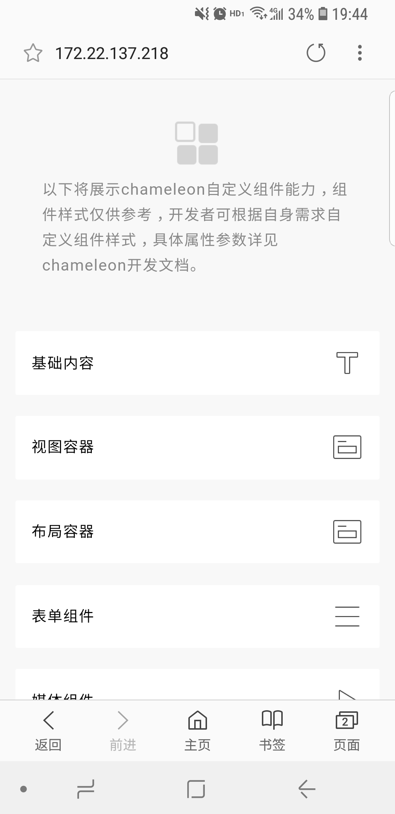
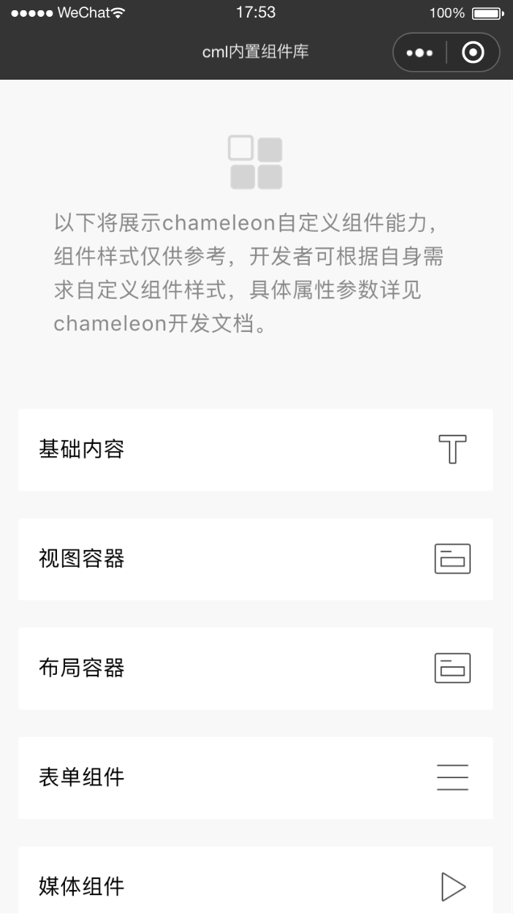
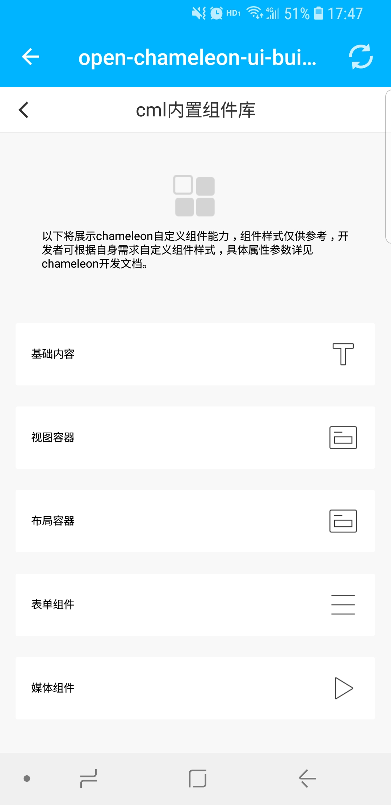

# chameleon-ui-builtin
本仓库为 `cml` 框架的内置组件库，提供跨端基础内置组件

详细见[cml内置组件文档](https://cmljs.org/doc/component/base/base.html)

## 简介
`cml` 提供了大量内置组件，包括但不限于以下类型：
- 基础内容
- 布局容器
- 表单组件
- 媒体组件

同时，`cml`提供给开发者[扩展多态组件](https://cmljs.org/doc/framework/polymorphism/component.html)的能力

例如:
```html
<template>
  <view class="flex-item"></view>
  <button type="blue" text="确定"/>
</template>
```

### 如何开发
```javascript
npm install
cml dev  //开始开发
```

### 多端预览效果

| web   |      微信小程序      |  native-weex |
|:----------:|:-------------:|:------:|
|  |  |  |

### chameleon编译中标签替换规则

#### 简单的标签替换

| cml        | web      | weex     | wx         | alipay     | baidu      |
| ---------- | -------- | -------- | ---------- | ---------- | ---------- |
| view       | div      | div      | view       | view       | view       |
| cover-view | div      | div      | cover-view | cover-view | cover-view |
| text       | span     | text     | text       | text       | text       |
| image      | img      | image    | image      | iamge      | iamge      |
| cell       | div      | cell     | view       | view       | View       |
| block      | template | template | block      | block      | block      |
|            |          |          |            |            |            |

#### 内置组件标签的替换

对于chameleon提供的一些内置基础组件，会替换成对应组件标签

| cml           | web                       | weex                      | wx                    | aliapy                | bvaidu                |
| ------------- | ------------------------- | ------------------------- | --------------------- | --------------------- | --------------------- |
| page          | cml-buildin-page          | cml-buildin-page          | cml-buildin-page      | cml-buildin-page      | cml-buildin-page      |
| scroller      | cml-buildin-scroller      | cml-buildin-scroller      | cml-buildin-scroller  | cml-buildin-scroller  | cml-buildin-scroller  |
| list          | cml-buildin-list          | cml-buildin-list          | cml-buildin-list      | cml-buildin-list      | cml-buildin-list      |
| container     | cml-buildin-container     | cml-buildin-container     | cml-buildin-container | cml-buildin-container | cml-buildin-container |
| row           | cml-buildin-row           | cml-buildin-row           | cml-buildin-row       | cml-buildin-row       | cml-buildin-row       |
| col           | cml-buildin-col           | cml-buildin-col           | cml-buildin-col       | cml-buildin-col       | cml-buildin-col       |
| button        | cml-buildin-button        | cml-buildin-button        | cml-buildin-button    | cml-buildin-button    | cml-buildin-button    |
| input         | cml-buildin-input         | cml-buildin-input         | cml-buildin-input     | cml-buildin-input     | cml-buildin-input     |
| textarea      | cml-buildin-textarea      | cml-buildin-textarea      | cml-buildin-textarea  | cml-buildin-textarea  | cml-buildin-textarea  |
| switch        | cml-buildin-switch        | cml-buildin-switch        | cml-buildin-switch    | cml-buildin-switch    | cml-buildin-switch    |
| radio         | cml-buildin-radio         | cml-buildin-radio         | cml-buildin-radio     | cml-buildin-radio     | cml-buildin-radio     |
| checkbox      | cml-buildin-checkbox      | cml-buildin-checkbox      | cml-buildin-checkbox  | cml-buildin-checkbox  | cml-buildin-checkbox  |
| video         | cml-buildin-video         | cml-buildin-video         | cml-buildin-video     | cml-buildin-video     | cml-buildin-video     |
| carousel      | cml-buildin-carousel      | cml-buildin-carousel      | swiper                | swiper                | swiper                |
| carousel-item | cml-buildin-carousel-item | cml-buildin-carousel-item | swiper-item           | swiper-item           | swiper-item           |

#### 多态组件中 origin-tag 替换为 tag

比如：

| cml           | web    | weex   | wx     | alipay | baidu  |
| ------------- | ------ | ------ | ------ | ------ | ------ |
| origin-button | button | button | button | button | button |
| origin-input  | input  | input  | input  | input  | Input  |

